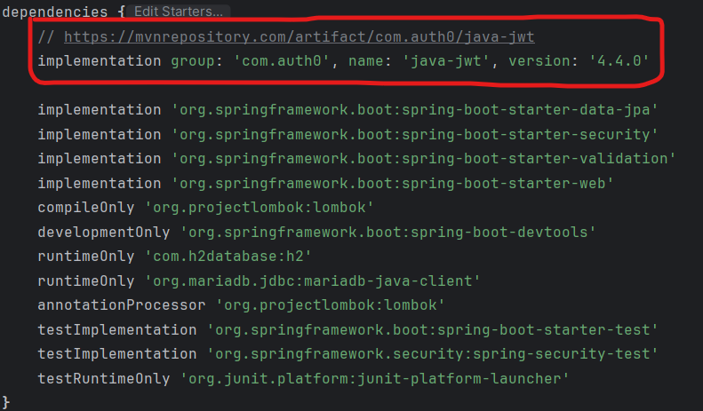
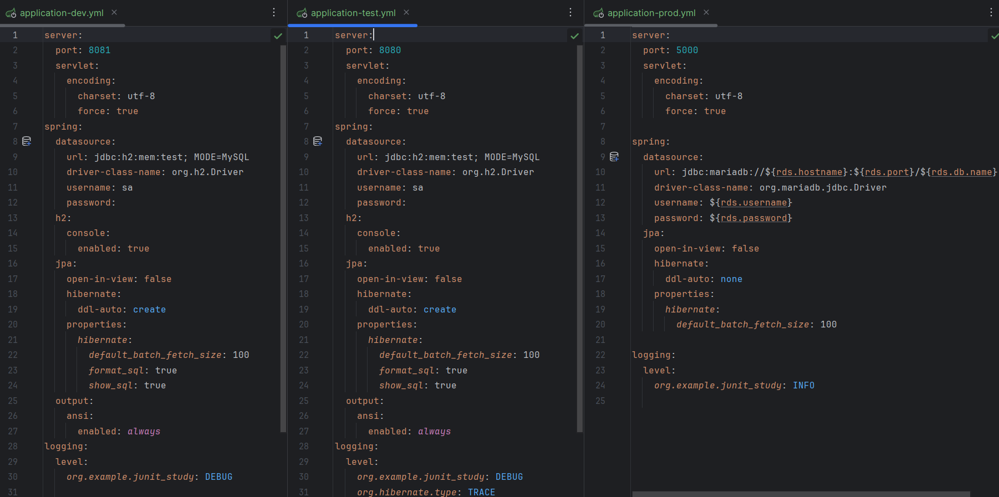
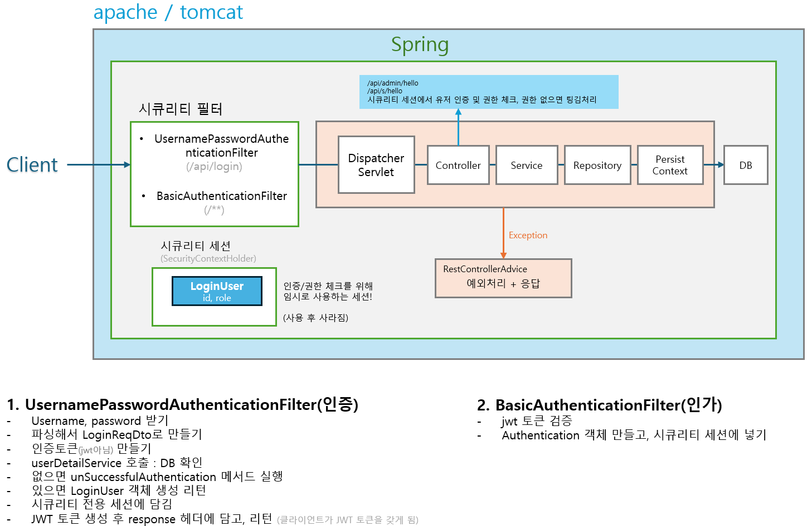

# 스프링부트 JUnit 테스트 - 시큐리티를 활용한 Bank 애플리케이션

[강의 링크](https://www.inflearn.com/course/lecture?courseSlug=%EC%8A%A4%ED%94%84%EB%A7%81%EB%B6%80%ED%8A%B8-junit-%ED%85%8C%EC%8A%A4%ED%8A%B8&unitId=147266)

인프런 강의를 듣고 기록한 스터디 내용입니다.

<h1>section 1.

## 스프링부트 설정 & 세팅

### JWT

프로젝트 생성 시 다른 기본적인 dependency는 제공해 주지만, JWT는 제공하지 않기 때문에, 사용을 위해 [MVN](https://mvnrepository.com/artifact/com.auth0/java-jwt/4.4.0) 에서 찾아서 복사/붙여넣기 하면 사용할 수 있다.

`build.gradle`

<p align="center">
 
</p>

### yml

application.yml로 프로젝트 환경 설정이 가능하다.
아래와 같이 yml을 개발용/테스트용/배포용 여러개 나눠 사용 가능하다.

```
개발용 application.yml 을 실행할 경우

spring:
  profiles:
    active:
      - dev
```

`application-dev.yml`
`application-test.yml`
`application-prod.yml`

<p align="center">
 
</p>

## 테이블 설계 및 엔티티 생성

bank 애플리케이션을 위한 테이블을 생성한다.

이때 user 테이블과 account 테이블을 1:N 으로 설계하고,

account 테이블과 transaction 테이블을 1:N 으로 설계한다.

**_Jpa LocalDataTime 자동 생성하는 법_**

- @EnableJpaAuditing ( Main 클래스 )
- @EntityListeners(AuditingEntityListener.class) ( Entity 클래스 )

```java
    @CreatedDate // Insert
    @Column(nullable = false)
    private LocalDateTime createdAt;

    @LastModifiedDate // Insert, update
    @Column(nullable = false)
    private LocalDateTime createdAt;
```

테이블(jpa) 의 속성 관련 코드는 각 테이블 별 링크 참조

[`User.java`](https://github.com/jeongHyeonu/spring-junit-test/blob/main/junit_study/src/main/java/org/example/junit_study/domain/user/User.java) [`Account.java`](https://github.com/jeongHyeonu/spring-junit-test/blob/main/junit_study/src/main/java/org/example/junit_study/domain/account/Account.java) [`Transaction.java`](https://github.com/jeongHyeonu/spring-junit-test/blob/main/junit_study/src/main/java/org/example/junit_study/domain/transaction/Transaction.java)

<h1>section 2.</h1>

## 스프링부트 시큐리티 세팅

강의에서 사용한 시큐리티 필터 체인 코드는 [링크](https://github.com/codingspecialist/junit-bank-class/blob/main/src/main/java/shop/mtcoding/bank/config/SecurityConfig.java) 에서 확인할 수 있다.

강의에 오류가 있는데, 위의 코드를 그대로 사용하면 최신 버전의 경우 deprecated 된 부분이 있어 오류가 발생한다.

최신 버전으로 수정한 코드는 [링크](junit_study\src\main\java\org\example\junit_study\config\SecurityConfig.java)에서 확인할 수 있다.

```java
기존 버전
http.headers().frameOptions().sameOrigin();
```

위와 같은 메서드 체이닝이 아닌 아래의 람다식을 통해 함수형으로 설정하는 것을 지향한다.

```java
최신 버전
http.headers(h -> h.frameOptions(f -> f.sameOrigin()));
```

**시큐리티 6.0부터는 websecurityconfigureradapter가 deprecated가 되고 SecurityFilterChain bean을 생성하도록 변경되었음을 유의하자.**

<h1>section 3.</h1>


회원가입 controller 만들기

(딱히 중요한거 없어서 생략..)


<h1>section 4.

## 스프링부트 JWT 인증과 인가

해당 과정을 잘 알아두자.

UPAF(인증) / BAF(인가)

<p align="center">
 
</p>

<h1>section 5.</h1>

### 계좌등록 서비스/컨트롤러 테스트

테스트시에는 insert 한것들이 전부 Persist Context에 올라감 (영속화)

유저 정보와 같은 데이터는 Persist Context에 있으면 DB에 쿼리를 하지 않고, 캐시를 해서 불러온다.

- 최초 select는 쿼리가 발생함. 
- Lazy 로딩은 PC에 있다면 쿼리 발생안함! (없으면 쿼리 발생)
- Junit 테스트에서 delete 쿼리 로그는 DB관련(DML)으로 가장 마지막에 실행되면 발동안됨.

영속화 된것들을 초기화 해주는 것이 개발 모드와 동일한 환경으로 테스트를 할 수 있게 해준다!

그러므로, 아래 코드와 같이 EntityManager로 Persist Context에 올라간 데이터를 지워줘야 한다.


`JUnit test Code`
```java
  // ...생략... //

  @Autowired
  private EntityManager em;

  @BeforeEach
  public void setUp() {
      userRepository.save(newUser()) // persist context에 데이터 저장 
      em.clear();
  }

  // ...생략... //
```


### JUnit Test 시 primary key 이슈 

> `@Transaction` 어노테이션은 테스트를 롤백시킨다!

`@Transaction` 어노테이션 유의점 :
  - `BeforeEach`로 데이터를 유저1(pk=1), 유저2(pk=2)를 insert 한 다음, 테스트 후 롤백된 다음 `BeforeEach`로 데이터를 insert 하게 된다면, 해당 유저의 pk=3, pk=4 가 된다.
  - 즉, 다음 테스트에 영향을 준다! (pk는 초기화 되지 않으므로..)

ID 조회 시 pk 문제로 이슈가 생길 수 있으므로, 쿼리로 테이블을 drop/truncate 를 해주는게 좋다


### @JsonIgnore
이 어노테이션은 클라이언트에 값을 노출하지 않고, 서버에서만 확인할 수 있다.
```java
    private Long id;
    private String name;

    // 클라이언트에 값을 보내지 않음, 서버에서만 테스트 용으로 확인
    @JsonIgnore
    private Long balance;
```


## Cors 테스트

클라이언트에서 인증 헤더를 받을 때, jwt 설정을 아래와 같이 설정해 주어야 한다.

```java
// jwt 설정 코드 중에서..

configuration.addExposedHeader("Authorization"); // 옛날에는 디폴트 였다 (지금은 아님)
```

그러면 클라이언트에서 쿠키/세션 스토리지로 보관 가능하다.

[(클라이언트 참고 코드)](https://github.com/codingspecialist/junit-bank-class/blob/main/fetch-test.html)


## 동적쿼리 생성

동적 쿼리란?

입출금내역과 같은 특정 상황이나 조건을 적용하여 검색하고 싶을 때 작성하는 쿼리. **JPQL** 을 이용한다.

`~Repository` / `~RepositoryImpl` ***인터페이스를 구현하는 방식*** 으로 작성해야 함을 유의할것! 이게 정석이고, 공식이다. 하나의 문법임을 기억하자!!

_(그렇게 안하면 동적 쿼리를 못 만들어낸다)_

`@Quary` 어노테이션을 이용해서 JPQL을 구현할 수 있지만, entityManager(em) 으로도 생성이 가능하다.

```java
// 동적 쿼리 만들고 결과 반환
List<entity> result = em.createQuery("select e from entity e where e.id = '1'", entity.class).getResultList();
```

[(예제 코드)](https://github.com/codingspecialist/junit-bank-class/blob/main/src/main/java/shop/mtcoding/bank/domain/transaction/TransactionRepositoryImpl.java)

## Inner Join & Outer Join

INNER JOIN에서는 일치하지 않는 레코드는 모두 버리지만, OUTER JOIN에서는 일치하지 않더라도 버리지 않고 NULL로 채워서 결과를 응답

예시 :

`A : 1, 2, 3` 이고, `B : 2, 3, 4` 일때

- Inner Join 시 - 교집합 : 2, 3
- Outer Join 시 - 합집합 : 1, 2, 3, 4